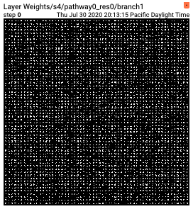

# Visualization Tools for PySlowFast

This document provides a brief intro for running various visualization tools provided with PySlowFast. Before launching any job, make sure you have properly installed the PySlowFast following the instruction in [README.md](README.md) and you have prepared the dataset following [DATASET.md](slowfast/datasets/DATASET.md) with the correct format.

## Tensorboard Support for Train/Eval/Test

We provide Tensorboard support during the train/eval/test pipeline to assist live monitoring various metrics, and class-level performance
with loss/error graphs, confusion matrices and histograms. Enable Tensorboard support by adding the following to your yaml config file:

```
TENSORBOARD:
  ENABLE: True
  LOG_DIR: # Leave empty to use cfg.OUTPUT_DIR/runs-{cfg.TRAIN.DATASET} as path.
  CLASS_NAMES_PATH: # Path to json file providing class_name - id mapping.
  CONFUSION_MATRIX:
    ENABLE: True
    SUBSET_PATH: # Path to txt file contains class names separated by newline characters.
                 # Only classes in this file will be visualized in the confusion matrix.
  HISTOGRAM:
    ENABLE: True
    TOP_K: 10   # Top-k most frequently predicted classes for each class in the dataset.
    SUBSET_PATH: # Path to txt file contains class names separated by newline characters.
                 # Only classes in this file will be visualized with histograms.
```

More details can be found at [defaults.py](slowfast/config/defaults.py)

### Loss & Error Graphs on Tensorboard:

<div align="center">
  
</div>

### Confusion matrices:

<div align="center">
  
  
</div>

<div align="center">

</div>

To enable this mode, set:
```
TENSORBOARD:
  ENABLE: True
  CATEGORIES_PATH: # Path to a json file for categories -> classes mapping
                   # in the format {"parent_class": ["child_class1", "child_class2",...], ...}.
  CONFUSION_MATRIX:
    ENABLE: True
```

### Histograms of top-k most frequent predictions:

<div align="center">
  
  
</div>

## Model Analysis

In addition, we provide tools to help with understanding your trained model(s), more options at [defaults.py](slowfast/config/defaults.py)

Adding the following to your yaml config file:
```
TENSORBOARD:
  ENABLE: True
  MODEL_VIS:
    ENABLE: True
    MODEL_WEIGHTS: # Set to True to visualize model weights.
    ACTIVATIONS: # Set to True to visualize feature maps.
    INPUT_VIDEO: # Set to True to visualize the input video(s) for the corresponding feature maps.
    LAYER_LIST: # List of layer names to visualize weights and activations for.
    GRAD_CAM:
      ENABLE: True
      LAYER_LIST: # List of CNN layers to use for Grad-CAM visualization method.
                  # The number of layer must be equal to the number of pathway(s).
```

### Weights Visualization on Tensorboard:

<div align="center">
  
  
</div>

### Feature Maps & Inputs Visualization:

<div align="center">
  
</div>

### Input Videos Visualization with Grad-CAM:

<div align="center">
  
  
</div>

## Run the Demo on Videos/Camera

To run inference with PySlowFast model(s) on wild video(s), add the following to your yaml config file:

```
DEMO:
  ENABLE: True
  LABEL_FILE_PATH: # Path to json file providing class_name - id mapping.
  INPUT_VIDEO: # Path to input video file.
  OUTPUT_FILE: # Path to output video file to write results to.
               # Leave an empty string if you would like to display results to a window.
  THREAD_ENABLE: # Run video reader/writer in the background with multi-threading.
  NUM_VIS_INSTANCES: # Number of CPU(s)/processes use to run video visualizer.
  NUM_CLIPS_SKIP: # Number of clips to skip prediction/visualization
                  # (mostly to smoothen/improve display quality with wecam input).
```

If you would like to use webcam as an input, in place of `DEMO.INPUT_VIDEO`, set `DEMO.WEBCAM` to the index of the webcam for input. Please check for more options at [defaults.py](slowfast/config/defaults.py)

### Action Recognition Demo:
<div align="center">
  
</div>

### Action Detection Demo:

<div align="center">
  
</div>

### Demo with AVA video(s):
We also offer an option to use trained models to create and visualize prediction results and ground-truth labels on AVA-format videos and metadata. An example config is:

```
DEMO:
  ENABLE: True
  OUTPUT_FILE: yourPath/output.mp4
  LABEL_FILE_PATH:  yourPath/ava_classnames.json
  INPUT_VIDEO: yourPath/frames/HVAmkvLrthQ  # Path to a video file or image folder
  PREDS_BOXES: yourPath/ava_detection_train_boxes_and_labels_include_negative.csv # Path to pre-computed bouding boxes in AVA format.
  GT_BOXES: yourPath/ava_train_v2.2.csv # Path to ground-truth boxes and labels in AVA format (optional).
```

<div align="center">
  
</div>


### Run command
```
python \tools\run_net.py --cfg path/to/<pretrained_model_config_file>.yaml
```
### Download class name files
- [AVA class names json file](https://drive.google.com/file/d/1qwQQg2FELIZWx68jShSUHMLhqjRut53P/view?usp=sharing)
- [Kinetics class names json file](https://drive.google.com/file/d/1_Yq-yM2oDcCv4TikyUvu3tVFpKOLnVpK/view?usp=sharing)
- [Kinetics parent-child class mapping](https://drive.google.com/file/d/1hJglykMda59aDF_ruYfMF9BhTxxQ6yaJ/view?usp=sharing)
