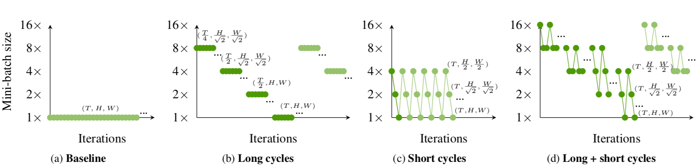

# A Multigrid Method for Efficiently Training Video Models
[Chao-Yuan Wu](https://www.cs.utexas.edu/~cywu/),
[Ross Girshick](http://rossgirshick.info)
[Kaiming He](http://kaiminghe.com),
[Christoph Feichtenhofer](http://feichtenhofer.github.io/),
[Philipp Kr&auml;henb&uuml;hl](http://www.philkr.net/)
<br/>
In CVPR, 2020. [[Paper](https://arxiv.org/abs/1912.00998)]
<br/>
<div align="center">
  
</div>
<br/>

```BibTeX
@inproceedings{multigrid2020,
  Author    = {Chao-Yuan Wu and Ross Girshick and Kaiming He and Christoph Feichtenhofer 
               and Philipp Kr\"{a}henb\"{u}hl},
  Title     = {{A Multigrid Method for Efficiently Training Video Models}},
  Booktitle = {{CVPR}},
  Year      = {2020}}
```

### Coming Soon
