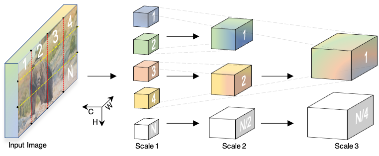

# Multiscale Vision Transformers
[Haoqi Fan](https://haoqifan.github.io/)\*, [Bo Xiong](https://www.cs.utexas.edu/~bxiong/)\*, [Karttikeya Mangalam](https://karttikeya.github.io/)\*, [Yanghao Li](https://lyttonhao.github.io/)\*, [Zhicheng Yan](https://sites.google.com/view/zhicheng-yan), [Jitendra Malik](http://people.eecs.berkeley.edu/~malik/), [Christoph Feichtenhofer](http://feichtenhofer.github.io/)\*,
<br/>
In arXiv, 2104.11227, 2021. [[Paper](https://arxiv.org/abs/2104.11227.pdf)]
<br/>
<div align="center">
  
</div>
<br/>


## Getting started

To use MViT-B models please refer to the configs under `configs/Kinetics`, or see the [MODEL_ZOO.md](https://github.com/facebookresearch/SlowFast/blob/master/MODEL_ZOO.md) for pre-trained models. See [paper](https://arxiv.org/abs/2104.11227.pdf) for details. For example, the command

```
python tools/run_net.py \
  --cfg configs/Kinetics/MVIT-B.yaml \
  DATA.PATH_TO_DATA_DIR path_to_your_dataset \
```

should train and test a MViT-B model on your dataset.

## Citing MViT
If you find MViT useful for your research, please consider citing the paper using the following BibTeX entry.
```BibTeX
@Article{mvit2021,
  author = {Haoqi Fan, Bo Xiong, Karttikeya Mangalam, Yanghao Li, Zhicheng Yan, Jitendra Malik, Christoph Feichtenhofer},
  title = {Multiscale Vision Transformers},
  journal = {arXiv:2104.11227},
  Year = {2021},
}
```
