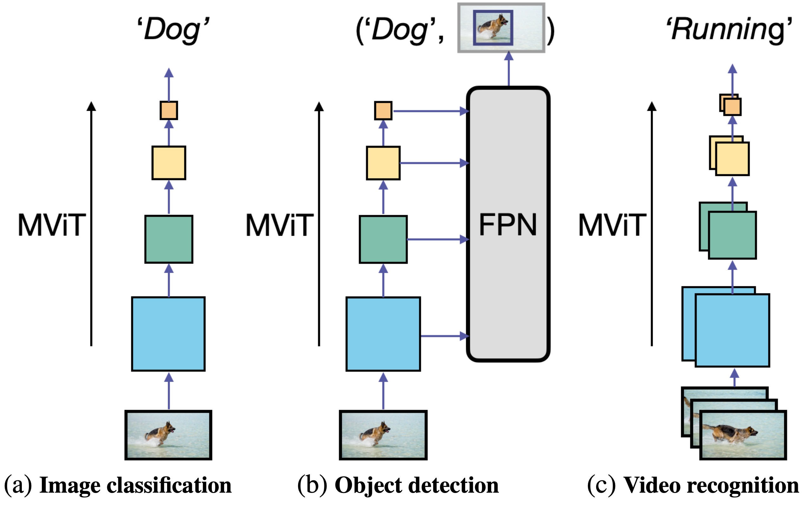

# [MViTv2: Improved Multiscale Vision Transformers for Classification and Detection](https://arxiv.org/abs/2112.01526)

Official PyTorch implementation of **MViTv2**, from the following paper:

[MViTv2: Improved Multiscale Vision Transformers for Classification and Detection](https://arxiv.org/abs/2112.01526). CVPR 2022.\
Yanghao Li*, Chao-Yuan Wu*, Haoqi Fan, Karttikeya Mangalam, Bo Xiong, Jitendra Malik, Christoph Feichtenhofer*

---

MViT is a multiscale transformer which serves as a general vision backbone for different visual recognition tasks. PySlowFast supports MViTv2 for video action recognition and detection tasks. For other tasks, please check:

> **Image Classification**: See [MViTv2 for image classification](https://github.com/facebookresearch/mvit).

> **Object Detection and Instance Segmentation**: See [MViTv2 in Detectron2](https://github.com/facebookresearch/detectron2/tree/main/projects/MViTv2).

<div align="center">
  
</div>
<br/>

## Results

### Kinetics-400


| name | frame length x sample rate | top1 |  top5  | Flops (G) x views | #params (M) |  model | config |
| ------------- | ------------- | ------------- | ------------- | ------------- | ------------- | ------------- | ------------- |
| MViTv2-S | 16 x 4 | 81.0 | 94.6 | 64 x 1 x 5 | 34.5 | [`link`](https://dl.fbaipublicfiles.com/pyslowfast/model_zoo/mvitv2/pysf_video_models/MViTv2_S_16x4_k400_f302660347.pyth) | Kinetics/MVITv2_S_16x4 |
| MViTv2-B | 32 x 3 | 82.9 | 95.7 | 225 x 1 x 5 | 51.2 | [`link`](https://dl.fbaipublicfiles.com/pyslowfast/model_zoo/mvitv2/pysf_video_models/MViTv2_B_32x3_k400_f304025456.pyth) | Kinetics/MVITv2_B_32x3 |
| MViTv2-L | 40 x 3 | 86.1 | 97.0 | 2828 x 3 x 5 | 217.6 | [`link`](https://dl.fbaipublicfiles.com/pyslowfast/model_zoo/mvitv2/pysf_video_models/MViTv2_L_40x3_k400_f306903192.pyth) | Kinetics/MVITv2_L_40x3_test |


### SSv2


| name | pretrain | frame length x sample rate | top1 |  top5  | Flops (G) x views | #params (M) |  model | config |
| ------------- | ------------- | ------------- | ------------- | ------------- | ------------- | ------------- | ------------- | ------------- |
| MViTv2-S | K400 | 16 x 4 | 68.2 | 91.4 | 64 x 3 x 1 | 34.4 | [`link`](https://dl.fbaipublicfiles.com/pyslowfast/model_zoo/mvitv2/pysf_video_models/MViTv2_S_16x4_ssv2_f308341823.pyth) | SSv2/MVITv2_S_16x4 |
| MViTv2-B | K400 | 32 x 3 | 70.5 | 92.7 | 225 x 3 x 1 | 51.1 | [`link`](https://dl.fbaipublicfiles.com/pyslowfast/model_zoo/mvitv2/pysf_video_models/MViTv2_B_32x3_ssv2_f305803282.pyth) | SSv2/MVITv2_B_32x3 |
| MViTv2-L | IN21K + K400 | 40 x 3 | 73.3 | 94.1 | 2828 x 3 x 1 | 213.1 | [`link`](https://dl.fbaipublicfiles.com/pyslowfast/model_zoo/mvitv2/pysf_video_models/MViTv2_L_40x3_ssv2_f309603968.pyth) | SSv2/MVITv2_L_40x3 |


### ImageNet-1K

| name | resolution |acc@1 | #params | FLOPs | 1k model |
|:---:|:---:|:---:|:---:| :---:|:---:|
| MViTv2-T | 224x224 | 82.3 | 24M | 4.7G | [model](https://dl.fbaipublicfiles.com/mvit/mvitv2_models/MViTv2_T_in1k.pyth) |
| MViTv2-S | 224x224 | 83.6 | 35M | 7.0G | [model](https://dl.fbaipublicfiles.com/mvit/mvitv2_models/MViTv2_S_in1k.pyth) |
| MViTv2-B | 224x224 | 84.4 | 52M | 10.2G | [model](https://dl.fbaipublicfiles.com/mvit/mvitv2_models/MViTv2_B_in1k.pyth) |

For more ImageNet results, please check the MViTv2 for image classification [repo](https://github.com/facebookresearch/mvit).

## Get started

Here we can train a standard MViTv2 model from scratch by:

```
python tools/run_net.py \
  --cfg configs/Kinetics/MVITv2_S_16x4.yaml \
  DATA.PATH_TO_DATA_DIR path_to_your_dataset \
```


## Citing MViTv2
If you find this repository helpful, please consider citing:
```
@inproceedings{li2021improved,
  title={MViTv2: Improved multiscale vision transformers for classification and detection},
  author={Li, Yanghao and Wu, Chao-Yuan and Fan, Haoqi and Mangalam, Karttikeya and Xiong, Bo and Malik, Jitendra and Feichtenhofer, Christoph},
  booktitle={CVPR},
  year={2022}
}

@inproceedings{fan2021multiscale,
  title={Multiscale vision transformers},
  author={Fan, Haoqi and Xiong, Bo and Mangalam, Karttikeya and Li, Yanghao and Yan, Zhicheng and Malik, Jitendra and Feichtenhofer, Christoph},
  booktitle={ICCV},
  year={2021}
}
```
