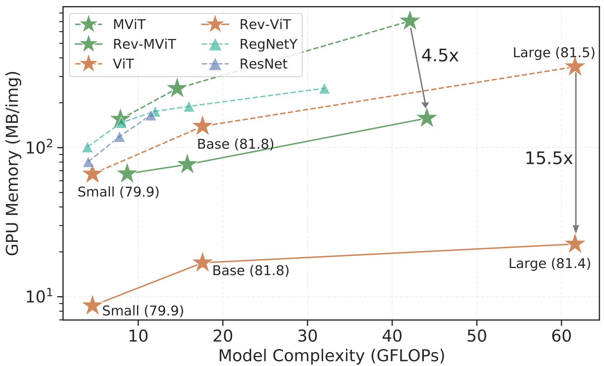

# Reversible Vision Transformers

Official PyTorch implementation of **Rev-ViT** and **Rev-MViT** models, from the following paper:
<br/>[Reversible Vision Transformers](https://openaccess.thecvf.com/content/CVPR2022/papers/Mangalam_Reversible_Vision_Transformers_CVPR_2022_paper.pdf)
[Karttikeya Mangalam](https://karttikeya.github.io/)\*, [Haoqi Fan](https://haoqifan.github.io/)\, [Yanghao Li](https://lyttonhao.github.io/)\, [Chao-Yuan Wu](https://chaoyuan.org/)\,  [Bo Xiong](https://www.cs.utexas.edu/~bxiong/)\,  [Christoph Feichtenhofer](http://feichtenhofer.github.io/)\*, [Jitendra Malik](http://people.eecs.berkeley.edu/~malik/)
CVPR 2022 (Oral)

**Project Homepage**: https://karttikeya.github.io/publication/revvit/

<br>
<div  align="center">

</div>
<br/>

## Pretrained Models

### ImageNet

| Architecture | #params (M) | FLOPs (G) | Top1 | weights | Config                |
| ------------ | ----------- | --------- | ---- | ------- | --------------------- |
| Rev-ViT-S    | 22          | 4.6       | 79.9 | [`link`](https://dl.fbaipublicfiles.com/pyslowfast/rev/REV_VIT_S.pyth)       | ImageNet/REV_VIT_S    |
| Rev-ViT-B    | 87          | 17.6      | 81.8      | [`link`](https://dl.fbaipublicfiles.com/pyslowfast/rev/REV_VIT_B.pyth)       | ImageNet/REV_VIT_B    |
| Rev-MViT-B   | 39          | 8.7       | 82.9*    | [`link`](https://dl.fbaipublicfiles.com/pyslowfast/rev/REV_MVIT_B.pyth)       | ImageNet/REV_MVIT_B_16_CONV   |

*improved from 82.5% reported in the [Paper Table 1](https://openaccess.thecvf.com/content/CVPR2022/papers/Mangalam_Reversible_Vision_Transformers_CVPR_2022_paper.pdf).

### Kinetics 400

| Architecture | frame length x sample rate | Top1 | Top5 | Flops (G) x views | #params (M) | weights | config                            |
| ------------ | -------------------------- | ---- | ---- | ----------------- | ----------- | ------- | --------------------------------- |
| Rev-MViT-B   | 16 x 4                     | 78.4   | 93.4    | 64 x 1 x 5        | 34.9        | [`link`](https://dl.fbaipublicfiles.com/pyslowfast/rev/REV_MVIT_B_16x4.pyth)       | Kinetics/REV_MVIT_B_16x4_CONV     |

## Getting started

To use Rev-ViT (or Rev-MViT) image models please refer to the configs under `configs/ImageNet`, and see [paper](https://openaccess.thecvf.com/content/CVPR2022/papers/Mangalam_Reversible_Vision_Transformers_CVPR_2022_paper.pdf) for details. For example, the command

```
python tools/run_net.py \

--cfg configs/ImageNet/REV_VIT_B.yaml \

DATA.PATH_TO_DATA_DIR path_to_your_dataset \
NUM_GPUS 1 \
```

should train and test a Reversible ViT Base Image model (trained with DeiT recipe) on your dataset. Please refer to [general repo-level](https://github.com/facebookresearch/SlowFast/blob/main/GETTING_STARTED.md) instruction for futher details.

For Rev-MViT video models, please run the `configs/Kinetics` configs as,
```

python tools/run_net.py \

--cfg configs/Kinetics/REV_MVIT_B_16x4_CONV.yaml \

DATA.PATH_TO_DATA_DIR path_to_your_dataset \
NUM_GPUS 1 \
```

## Citing Rev-ViT \& Rev-MViT

If you find Reversible Models useful for your research, please consider citing the paper using the following BibTeX entry.

```BibTeX


@inproceedings{mangalam2022,

  title = {Reversible Vision Transformers},

  author = {Mangalam, Karttikeya and Fan, Haoqi and Li, Yanghao and Wu, Chao-Yuan and Xiong, Bo and Feichtenhofer, Christoph and Malik, Jitendra},

  booktitle = {Proceedings of the IEEE/CVF Conference on Computer Vision and Pattern Recognition},

  year = {2022},
}

```
