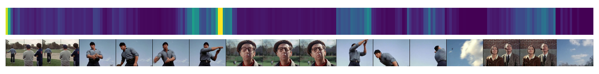

# Video Transformer Network
Daniel Neimark, Omri Bar, Maya Zohar, Dotan Asselmann [[Paper](https://arxiv.org/abs/2102.00719)]

<div align="center">
  
  
</div>
<br/>


## Installation
```
pip install timm
pip install transformers[torch]
```

## Getting started
To use VTN models please refer to the configs under `configs/Kinetics`, or see 
the [MODEL_ZOO.md](https://github.com/facebookresearch/SlowFast/blob/master/MODEL_ZOO.md) 
for pre-trained models*.

To train ViT-B-VTN on your dataset (see [paper](https://arxiv.org/abs/2102.00719) for details): 
```
python tools/run_net.py \
  --cfg configs/Kinetics/VIT_B_VTN.yaml \
  DATA.PATH_TO_DATA_DIR path_to_your_dataset \
```

To test the trained ViT-B-VTN on Kinetics-400 dataset:
```
python tools/run_net.py \
  --cfg configs/Kinetics/VIT_B_VTN.yaml \
  DATA.PATH_TO_DATA_DIR path_to_kinetics_dataset \
  TRAIN.ENABLE False \
  TEST.CHECKPOINT_FILE_PATH path_to_model \
  TEST.CHECKPOINT_TYPE pytorch
```

\* VTN models in [MODEL_ZOO.md](https://github.com/facebookresearch/SlowFast/blob/master/MODEL_ZOO.md) produce slightly
different results than those reported in the paper due to differences between the PySlowFast code base and the
original code used to train the models (mainly around data and video loading).

## Citing VTN
If you find VTN useful for your research, please consider citing the paper using the following BibTeX entry.
```BibTeX
@article{neimark2021video,
  title={Video Transformer Network},
  author={Neimark, Daniel and Bar, Omri and Zohar, Maya and Asselmann, Dotan},
  journal={arXiv preprint arXiv:2102.00719},
  year={2021}
}
```


## Additional Qualitative Results

<div align="center">
    <p>
    Label: Tai chi. Prediction: Tai chi.<p>
    <p>
    Label: Chopping wood. Prediction: Chopping wood.<p>
    <p>
    Label: Archery. Prediction: Archery.<p>
    <p>
    Label: Throwing discus. Prediction: Flying kite.<p>
    <p>
    Label: Surfing water. Prediction: Parasailing.<p>
</div>


