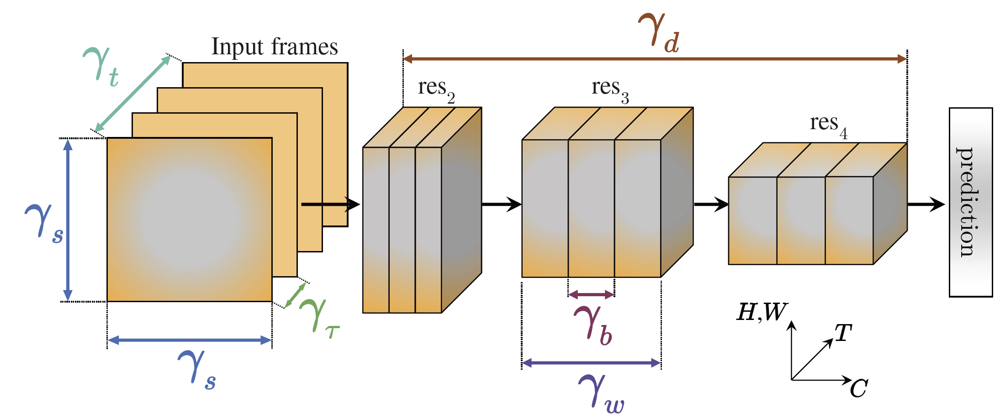
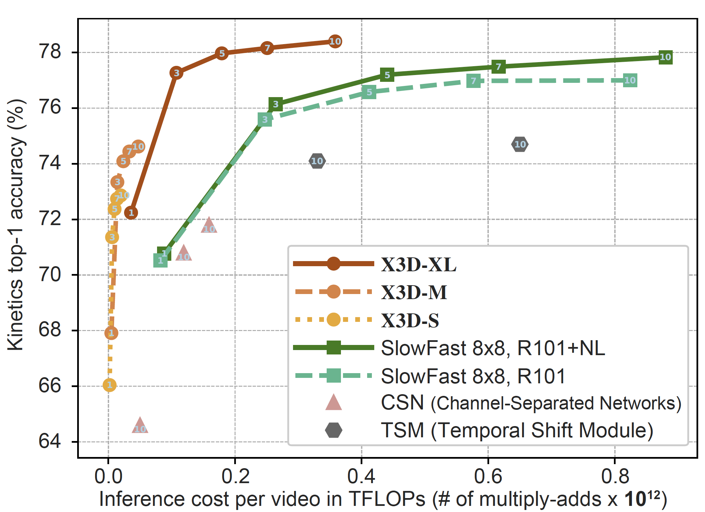

# X3D: Progressive Network Expansion for Efficient Video Recognition
[Christoph Feichtenhofer](http://feichtenhofer.github.io/),
<br/>
In CVPR, 2020. [[Paper](https://arxiv.org/abs/2004.04730)]
<br/>
<div align="center">
  
  
</div>
<br/>


## Getting started
**IMPORTANT** The naïve implementation of channelwise 3D convolution (Conv3D operation with group size > 1) in PyTorch is extremely slow. To have fast GPU runtime with X3D models, please patch the following pull request before using X3D: [Conv3D pull request](https://github.com/pytorch/pytorch/pull/40801)

To use X3D models please refer to the configs under `configs/Kinetics`, or see the [MODEL_ZOO.md](https://github.com/facebookresearch/SlowFast/blob/master/MODEL_ZOO.md) for pre-trained models. See [paper](https://arxiv.org/abs/2004.04730) for details. For example, the command

```
python tools/run_net.py \
  --cfg configs/Kinetics/X3D-XS.yaml \
  DATA.PATH_TO_DATA_DIR path_to_your_dataset \
```

should train and test an extra small (XS) X3D model on your dataset.

## Citing X3D
If you find X3D useful for your research, please consider citing the paper using the following BibTeX entry.
```BibTeX
@inproceedings{x3d2020,
  Author    = {Christoph Feichtenhofer},
  Title     = {{X3D}: Progressive Network Expansion for Efficient Video Recognition},
  Booktitle = {{CVPR}},
  Year      = {2020}}
```
